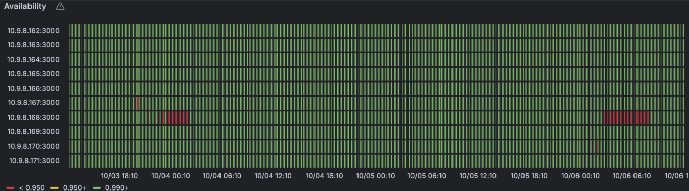
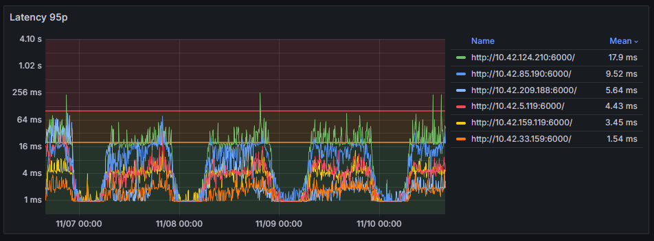
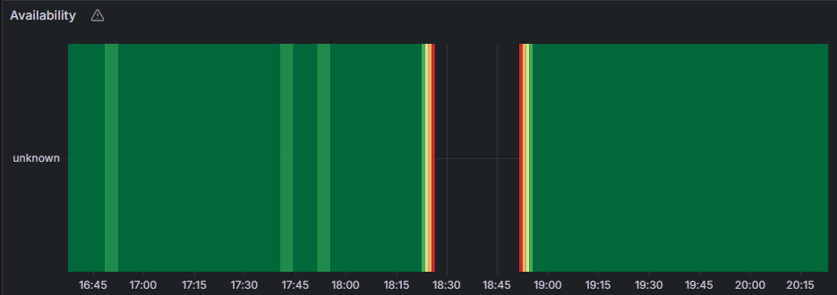

# Introduction: The Observability Context at Equativ

At Equativ, operating in a world of high traffic and low latency is our daily reality, and observability is not just a best practice; it's a critical business necessity. Our engineering teams have been a driving force, establishing a robust observability stack that encompasses logs, metrics, traces and profiles. We have instrumented most of our applications to ensure we know exactly what is happening under the hood.

However, even with this extensive toolset, a critical piece of the puzzle remained elusive: obtaining reliable and precise information about the I/O latency from our engines to core middlewares. Latency issues are often a complex, multi-variable problem, and without an unbiased, accurate source of truth for the health of our external dependencies, troubleshooting could turn into a challenging, time-consuming investigation. This blind spot is precisely what led us to launch an internal initiative to develop a new, dedicated synthetic agent designed to resolve the ambiguity of middleware availability and latency measurement.

# The Challenge: Why Latency Measurement Was Non-Trivial

Measuring I/O latency accurately is a two-part challenge, particularly when dealing with a high number of requests across various third-party and internal systems. We found that the traditional metrics we had access to were often biased or incomplete, preventing us from confidently determining the root cause of a latency spike.

## 1. Server-Side Limitations

Many external or third-party services either do not provide detailed latency metrics or use heterogeneous naming conventions, making unified monitoring difficult. Crucially, server-side metrics do not include the time spent across the network layers. We could see a server reporting a 2ms response time, but the engine waiting for the response might be experiencing 15ms due to network congestion or routing issues, leaving a significant, untraceable gap.

## 2. Client-Side Bias

While client-side monitoring includes the network latency, it introduces a major bias, especially when apps are under heavy load. The sheer volume of traffic and the asynchronous programming model of .NET meant that:
The internal asynchronous life cycle was impacted, leading to imprecise latency measurements. The time recorded between the call initiation and completion was often inflated by the engine's own internal queueing and scheduling delays.
This imprecision made it nearly impossible to determine the true culprit (Is it the middleware? Is it our engine under load? Is it the network?).
This dual challenge demonstrated a clear need for an independent, unbiased monitoring source.

# The Genesis of Our Synthetic Agent: Anubis

The solution to an unbiased latency measurement lays in creating a dedicated, synthetic monitoring agent.

## What is Anubis?

The new system is a fairly simple application deployed across our clusters. It acts as an internal synthetic agent whose sole purpose is to monitor middleware instances from within our environment, rather than externally.

Instead of being a service under load, Anubis simply performs regular, synthetic requests to the monitored middlewares. This design choice gives it three core benefits that overcome the traditional monitoring challenges:

  1. **Unbiased Measurement**: Because the agent has virtually no operational load, its latency measurements are not inflated or biased by the asynchronous lifecycle or memory pressure in our high-traffic engines. It reports the true response time of the middleware.
  2. **Client-Side with Network Context**: By running the monitoring probe from within the cluster, we gain accurate **client-side monitoring** that naturally includes the full network layer latency, providing a true measure of the application-to-middleware communication path.
  3. **Instance-Level Homogeneity**: The system exposes **homogeneous metrics** for all monitored services, regardless of the middleware's native reporting format. More importantly, it monitors **instances individually**. This makes cross-comparison easy and is essential for spotting single nodes that are acting as outliers and silently dragging down the overall performance of the service.

# Concrete Results: When the Agent Proved Its Worth

The primary measure of success for our new synthetic agent is its ability to provide actionable data that was previously obscured. Since its deployment, it has proven indispensable in several real-world scenarios:

  - **Outlier Detection**: The ability to monitor individual instances allowed us to immediately detect and pinpoint performance degradation caused by the **sporadic unavailability of a single KV store node**, which was leading to increased latencies across our engines. This level of granularity allowed for a fast and surgical resolution, minimizing service impact.
  
  - **Identifying Heterogeneity**: The agent uncovered severe latency heterogeneity in an gRPC API. We were able to trace the root cause not to the application code or the API itself, but to **nodes having different network cards** and related configuration issues, compounded by network load. Without the agent's unbiased and granular measurement, this hardware-level issue would have been extremely difficult to diagnose.
  
  - **External Service Disruption**: The tool provided clear, immediate evidence when a critical external service was failing to respond for a period of over half an hour. The precise latency and unavailability metrics generated by the agent offered undeniable proof of the disruption.
  

# Conclusion

Anubis started as a focused solution to a critical blind spot in our observability stack and it has proven its value far beyond initial expectations. By offering an independent, unbiased source of truth for I/O latency and middleware availability, it gives us the clarity we were missing.

With Anubis in place, we can now:
  - detect degraded instances immediately
  - expose network-related issues that would otherwise stay hidden
  - and confirm external service disruptions with undeniable evidence

Most importantly, it reduces the time between suspicion and certainty, turning complex latency investigations into fast, data-driven responses.
Simple by design but powerful in practice, Anubis has now become a core part of how we monitor and protect our production environment.