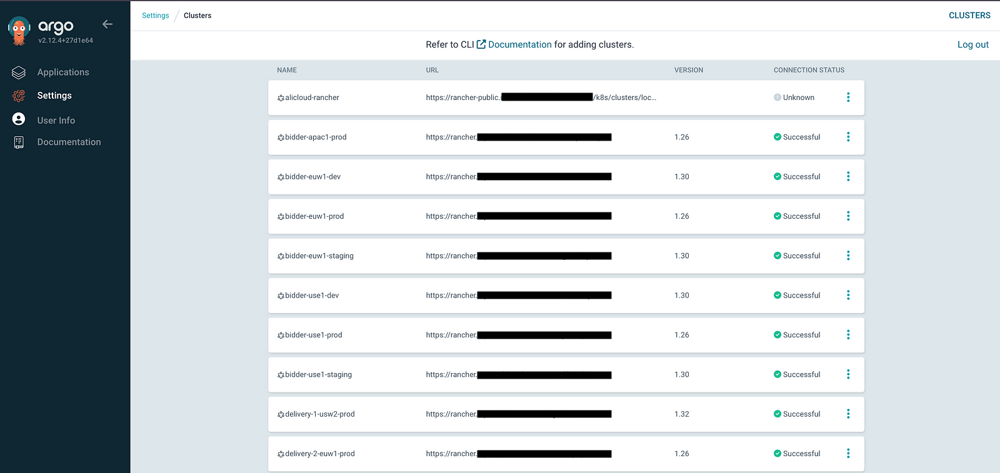

In cloud native world, where the company focusses on having multi cloud presence, it can get messy real quick when there are multiple Kubernetes clusters to manage across various platforms. Rancher solves this problem by abstracting the underlying infrastructure and with that we can manage all our K8s clusters under a single dashboard.

At Equativ we extend this to Deployments too by integrating Rancher with ArgoCD. While Rancher abstracts the infrastructure, ArgoCD will make the deployment process smooth.

Argo CD (short for Argo Continuous Delivery) is a declarative, GitOps-based continuous delivery tool for Kubernetes. Instead of managing Kubernetes manifests manually or through scripts, Argo CD lets you define the desired state of your applications in Git, and then it automatically syncs your clusters to match that state.

This approach not only makes deployments more predictable and repeatable, but it also boosts team collaboration and change tracking - Git becomes your single source of truth. Argo CD also comes with a clean web UI and role-based access control.

Flux CD, Spinnaker, Harness CD are some of its competitors.

## Why Integrate Rancher with ArgoCD?

Managing Kubernetes clusters and deploying applications across multiple platforms can quickly become overwhelming. Rancher helps abstract the underlying infrastructure, whether in GKE, EKS, or on-premise, providing a centralized control plane for cluster management. On the other hand, ArgoCD automates the deployment process by syncing Kubernetes clusters with Git repositories, ensuring continuous delivery and reducing manual intervention.
By integrating Rancher with ArgoCD, you achieve:
1. **Unified Cluster Management**: Rancher allows you to manage multiple Kubernetes clusters across different environments (GKE, EKS, and on-prem) from a single interface, making it easier to oversee and maintain your infrastructure.
2. **Seamless Multi-Cloud Deployments**: ArgoCD can deploy applications to clusters across different cloud environments, ensuring consistent deployments regardless of where the cluster resides.
3. **GitOps Workflow**: ArgoCD follows a GitOps model, meaning that your application deployments and infrastructure changes are version-controlled in Git repositories. Any changes in the Git repository are automatically applied to the connected clusters, ensuring a more streamlined and automated deployment process.
4. **Improved Developer and SRE Experience**: Developers and Site Reliability Engineers (SREs) can focus more on building and maintaining the applications instead of managing the complexity of different cloud environments.

## Deploy ArgoCD

To deploy ArgoCD in your environment, use the helm chart and configure necessary values.
```
helm repo add argo https://argoproj.github.io/argo-helm
helm install argocd argo/argo-cd --namespace argocd
```

## Connect Rancher and ArgoCD

To connect Rancher and ArgoCD , the clusters in Rancher needs to be configured in ArgoCD along with the bearer token to access the cluster.
Generate token to access the rancher cluster using terraform. Cluster details needs to be passed as variables.
```
resource "rancher2_token" "token" {
  description = "ArgoCD cluster token"
  cluster_id  = var.cluster_id
  ttl         = var.cluster_token_ttl
}

resource "vault_generic_secret" "cluster" {
  path = "<vault-path>"

  data_json = jsonencode({
    server = var.cluster_address
    name   = var.cluster_name
    config = jsonencode({ bearerToken = rancher2_token.token.token })
  })
}
```
2. Configure ExternalSecrets for all the clusters by fetching the secrets from vault, generated in previous step. This will be used by ArgoCD to access all the k8s clusters in rancher.
```
apiVersion: external-secrets.io/v1beta1
kind: ExternalSecret
metadata:
  name: "cluster-name"
  annotations:
    argocd.argoproj.io/sync-options: SkipDryRunOnMissingResource=true
    argocd.argoproj.io/secret-type: cluster
spec:
  secretStoreRef:
    name: "{{ $.Values.secretStore.name }}"
    kind: "{{ $.Values.secretStore.kind }}"
  target:
    template:
      metadata:
        annotations:
        labels:
          argocd.argoproj.io/secret-type: cluster
          applications.argoproj.io/app-name: argocd
  dataFrom:
    - extract:
        key: "argocd/clusters/cluster-name"
```
 

Deploy the argocd-clusters application which would then generate all these secrets and also, in ArgoCD UI you can check all the rancher cluster's status.

3. Once the clusters are connected, you can configure ArgoCD to deploy applications based on a GitOps model. Set up a Git repository that contains your Kubernetes manifests, Helm charts, or Kustomize configurations.

At Equativ, ArgoCD is mainly useful for creating core-services. Core-service helps developers in focussing more on the application development rather than the standard set of services that are needed to run the application. For example, We use ArgoCD to deploy ingresses, certs, external-dns, create storage classes etc. 

Basic structure of the files in any of the ArgoCD project is as below. This may vary for some of the projects.
```
- application_name
  - extras/
    - aws/
    - gke/
  - values/
    - dc1.yml
    - dc2.yml
  - application_set.yml
  - kustomization.yml
```

Below is the example of one of the ApplicationSet and its parameters.

```
---
apiVersion: argoproj.io/v1alpha1
kind: ApplicationSet
metadata:
  name: ingress-haproxy-public-eks
  labels:
    app: ingress-haproxy-public-eks
spec:
  generators:
    - list:
        elements:
          - cluster: cluster_name
            dc: usw3
            subnet: subnet_name
  goTemplate: true
  template:
    metadata:
      name: "{{ default .cluster .name }}-haproxy-public-eks" # shortened because of app name limit
      labels:
        app: ingress-haproxy-public-eks
    spec:
      project: coe-infra
      syncPolicy:
        syncOptions:
          - CreateNamespace=true
        automated:
          prune: true
      destination:
        name: "{{ .cluster }}"
        namespace: ingress-haproxy-public
      sources:
        - repoURL: https://gitlab.com/argocd-core-services.git
          targetRevision: main
          path: "prod/apps/ingresses/eks/extra/"
        - repoURL: "https://haproxytech.github.io/helm-charts"
          chart: kubernetes-ingress
          targetRevision: 1.44.0
          helm:
            releaseName: ingress-haproxy-public
            parameters:
              - name: installCRDs
                value: "true"
            values: |
              <Values to be overridden>
```

- **apiVersion**: Specifies the API version of the Argo CD resource.
- **kind**: Defines the type of resource, here it's an ApplicationSet used to generate Argo CD applications.
- **metadata.name**: Name of the ApplicationSet resource.
- **metadata.labels**: Metadata tags used for categorization and filtering.
- **spec.generators**: Defines how applications are generated; in this case, a static list.
- **list.elements**: Specifies the clusters and related metadata for each application instance.
- **cluster**: Target cluster where the application will be deployed.
- **dc**: Datacenter identifier.
- **subnet**: Subnet identifier.
- **goTemplate**: Enables Go templating syntax for dynamic field generation.
- **template.metadata.name**: Dynamically generates application names using cluster info.
- **template.metadata.labels**: Sets labels for the generated applications.
- **template.spec.project**: Argo CD project this application belongs to.
- **template.spec.syncPolicy**: Defines sync behavior, including auto-sync and pruning.
- **syncOptions.CreateNamespace**: Automatically creates the namespace if it doesn’t exist.
- **automated.prune**: Removes resources no longer defined in Git.
- **destination.name**: Specifies the target cluster by name.
- **destination.namespace**: Namespace where the application will be deployed.
- **sources[0].repoURL**: Git repository containing the Argo CD app manifests.
- **sources[0].targetRevision**: Git branch to use.
- **sources[0].path**: Path in the repo where the application manifests are located.
- **sources[1].repoURL**: Helm chart repository URL for external dependencies.
- **sources[1].chart**: Name of the Helm chart to install (HAProxy Ingress Controller).
- **sources[1].targetRevision**: Helm chart version to deploy.
- **helm.releaseName**: Name for the Helm release in the cluster.
- **helm.parameters**: Key-value pairs passed as Helm chart values.
- **helm.parameters.installCRDs**: Ensures CRDs are installed as part of Helm release.
- **helm.values**: Additional Helm values provided as raw YAML.


## Conclusion

Integrating Rancher with ArgoCD enables organizations to achieve a seamless and automated multi-cloud deployment experience. Rancher simplifies accessing Kubernetes clusters across various platforms, while ArgoCD ensures consistent, GitOps-driven application delivery. By combining these tools, developers and SREs can focus on building and scaling applications without worrying about the complexity of managing multi-cloud environments. This powerful integration unlocks greater agility, efficiency, and scalability for organizations operating across diverse cloud infrastructures.