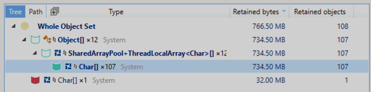

We've all been there — an application that was running smoothly suddenly starts behaving unpredictably. CPU spikes, erratic memory usage, and sluggish performance with no obvious culprit. Recently, we faced such an issue in one of our applications, where CPU usage fluctuated wildly between 20% and 100%. Digging deeper, we uncovered unexpected memory allocations and garbage collection behavior, leading us on a journey through profiling, memory dumps, and even some ad hoc solution to track down the root cause. 

This post walks you through our investigation, highlighting the techniques we used to diagnose and resolve the issue.

#  Analyzing metrics

The first signs of trouble came from our monitoring dashboards. The application's CPU usage was highly erratic, swinging between ~20% and ~100%:


A deeper look revealed that memory usage was also fluctuating:


And garbage collection (GC) activity was similarly unstable:


A significant amount of time was spent in Gen 2 and Large Object Heap (LOH) collections, suggesting that large allocations were causing long GC collections. This, in turn, led to high CPU usage as the garbage collector worked to free and compact memory while blocking threads.

To confirm our suspicions, we turned to another observability technique: profiling.

# Profiling the application

Comparing the profiling data of the affected instance against a healthy one quickly revealed key differences:


A large portion of the allocations stemmed from the [TryReadPlpUnicodeChars](https://github.com/dotnet/SqlClient/blob/cbfa11916d4924ed305c5cb033db6ad3c95d3cdd/src/Microsoft.Data.SqlClient/netcore/src/Microsoft/Data/SqlClient/TdsParser.cs#L12884) method in `Microsoft.Data.SqlClient`, responsible for parsing SQL strings.

At first glance, the method seemed well-optimized, leveraging buffer pooling to minimize allocations. But something was clearly off — why was a method designed to reduce allocations now causing a memory issue?

To find out, we needed a memory dump.

# Dumping memory for deeper insights

Taking a memory dump and analyzing it with dotMemory confirmed our suspicions: `TryReadPlpUnicodeChars` was indeed the main source of excessive allocations. At the time of the dump, nearly 1GB of buffers were retained in the `SharedArrayPool`:



The retained buffers also followed a curious pattern — sizes increasing in powers of two, starting at 65,536 bytes:


Upon analyzing the SqlClient code, we discovered that when reading a column with an unknown size, the client starts with a small buffer and progressively requests larger ones as needed. Since `SharedArrayPool` allocates in power-of-two buckets, this resulted in excessive memory consumption.

Most concerningly, some of these buffers contained single strings larger than 16MB — far beyond what should have been stored in our database.

We had found the root cause: unexpectedly large strings in our database. Now, we needed to track down their source.

# Finding the needle in the haystack

Identifying the culprit string was tricky. Our database contains numerous tables, and our application executes many SQL queries. Manually checking each query wasn't feasible.

Ideally, we wanted a way to instrument `SqlClient` to log the size of each retrieved column. However, modifying or wrapping `SqlDataReader` isn't straightforward due to the way the library is structured.

Enter __modding__.

Yes, just like we sometimes do with games! .NET allows us to patch methods dynamically using [Harmony](https://github.com/pardeike/Harmony). This library lets us intercept and modify method calls at runtime, making it the perfect tool for our needs. 

# Patching the method

As I mentioned earlier, our goal was to catch at least one of those big strings being returned by `SqlClient`, and more specifically by its reader, `SqlDataReader`. In our codebase, strings usually come from a single method: `GetString`. Naturally, it became our main suspect.

To keep an eye on it, we used Harmony to patch `SqlDataReader.GetString(int index)` and log whenever it returned a suspiciously large value.


```csharp
[HarmonyPatch(typeof(SqlDataReader), nameof(SqlDataReader.GetString))]
public class SqlClientPatch
{
    public static ILogger Logger { get; set; }
    public static void Postfix(int i, SqlDataReader __instance, SqlCommand ____command, string __result)
    {
        var size =  Math.Round((double)__result.Length * sizeof(char) / 1024 / 1024);

        // We only want big strings, greater than 1MB
        if (size < 1)
        {
            return;
        }

        Logger.LogWarning(
            "Large SQL query detected (index {index} is {size} MB): {Query}",
            i,
            size,
            ____command.CommandText
        );
    }
}
```
## Explanation

- `__instance` refers to the current SqlDataReader instance.

- `__result` is the returned string.

- `____command` retrieves the SQL command, using four underscores to access a private field (`_command`).

- If a string exceeds 1MB, we log its size and the query that fetched it.

Once implemented, we activated the patch:
```csharp
// Injecting the logger
SqlClientPatch.Logger = logger;
var harmony = new Harmony("Equativ.Application.Patch");
harmony.PatchAll();
```
More details on Harmony's capabilities can be found [here](https://harmony.pardeike.net/articles/intro.html).

# Wrapping up

With our patched `SqlClient`, we quickly identified the problematic SQL query. Further investigation revealed that a peculiar database entry contained an unexpectedly large string value. After cleaning up this entry and ensuring proper constraints were enforced, the issue disappeared.

This debugging journey showcased the power of profiling, memory analysis, and creative solutions like monkey-patching. Each tool has its role: broad tools provide an overview but lack detail, while precise tools offer deep insights but can be time-consuming when you don’t know exactly what to look for. Striking the right balance is key — and always worth remembering.

---

I hope you found this post insightful! Have you ever had to troubleshoot a similarly tricky performance issue? Let's discuss in the comments!
